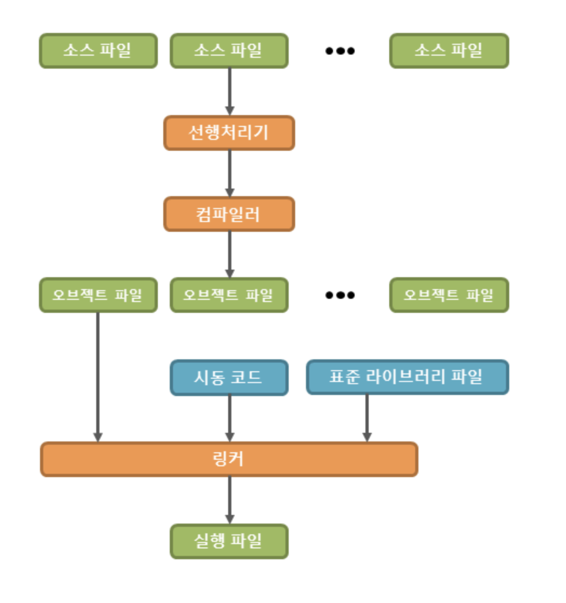

# c++ 프로그래밍

## 프로그래밍

- 과정
  1. 소스파일 구현
  2. 선행 처리기
  3. 컴파일러
  4. Object 파일
  5. 링커
  6. 실행파일
     

## 소스파일의 작성

- 에디터 등을 통한 소스파일 작성
- 보통 작성 파일의 확장자 c++ 기준 .cpp / db랑 연동해서 컴파일 2번하는 금융권 소스파일도 있음

## 선행처리기

- \# 로 시작하는 선행처리기의 문자를 먼저 처리하는 작업을 의미
- 코드를 생성하는 것이 아닌, 컴파일러가 작업하기 좋도록 소스를 재구성하는 역할

## 컴파일러

- 컴퓨터가 이해할 수 있는 언어는 0, 1이기 때문에 소스를 기계어로 변환하기 위한 작업을 컴파일이라고 함
- .o, .obj 파일의 확장자로 변환

## 링커

- C계열의 언어는 OS 종속적인데, 컴파일러에 의해 생성된 오브젝트 파일은 운영체자와의 인터페이스를 담당하는 시동코드(Startup코드) 를 가지고 있지 않으며, 표준 라이브러리 파일도 없다
- `하나 이상의 오브젝트 파일과 라이브러리 파일, 시동 코드 등을 합쳐 하나의 파일로 만드는 작업을` 링크라고 함
- 여러개의 소스 파일을 작성하여 최종적으로 링크를 통해 하나의 실행파일로 만드는 것을 분할 컴파일이라고 함

## 실행파일

- .exe 확장자
