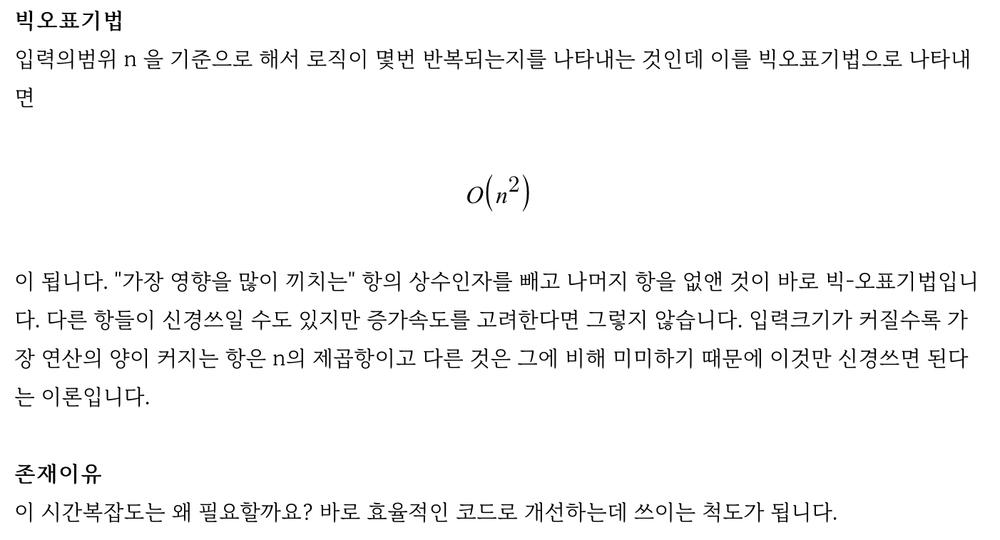
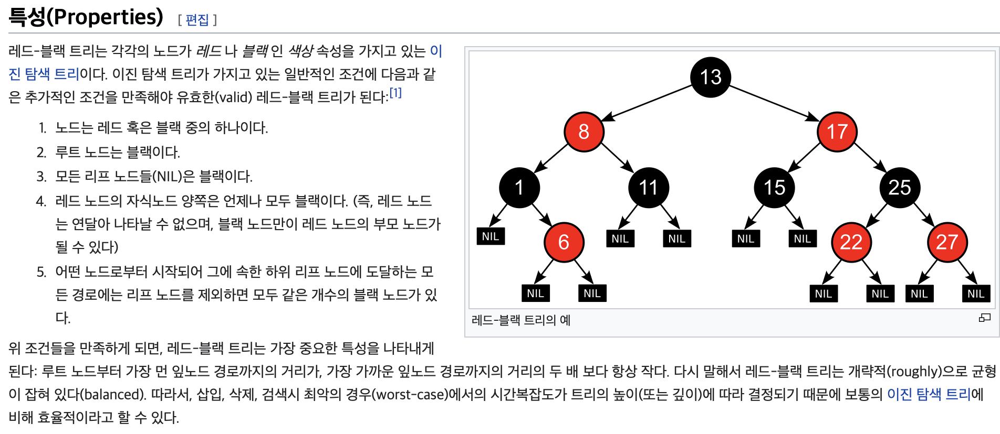

# 개념강의

> `저작권 : 큰돌 알고리즘 `  
> `https://m.blog.naver.com/jhc9639/222283814653?referrerCode=1 `

## 1) 시간복잡도


> [`참고할 내 시간복잡도별 알고리즘 선택 정리`](https://korshika.tistory.com/38)

## 2) 빅오 표기법



### 2-1) 기본 알고리즘 시간복잡도


- Red Black tree
  - map 인 경우에 RedBlack Tree 따름
    [map 설명된 블로그 글](https://life-with-coding.tistory.com/305)
      
    

### 2-2) STL


## 3) 공간복잡도


- 배열의 경우 1000만 미만인 경우가 대부분!
- 위의 경우를 제외하고, 1000만이 넘으면 메모리 부족한 경우가 대부분

## 4) 재귀함수


> [`내 재귀함수 및 동적 프로그래밍 정리`](https://teal-millennium-79f.notion.site/Dynamic-Programming-VS-Divide-and-conquer-Greedy-0a3ae18e37b44516aa93243f8802acfc)

- 예시
  

  

  ```c++
    #include <bits/stdc++.h>
    using namespace std;
    int fibo(int idx){
      if(idx == 0 || idx == 1) return idx;
      return fibo(idx - 1) + fibo(idx - 2);
    }

    int main() {
        ios_base::sync_with_stdio(false);
        cin.tie(NULL);
        cout.tie(NULL);
        cout << fibo(10);  // 55
        return 0;
    }
  ```

## 5) 누적합


```c++
  #include<bits/stdc++.h>
  using namespace std;
  typedef long long ll;
  int a[100004], b, c, psum[100004], n ,m;
  int main(){
    ios_base::sync_with_stdio(false); cin.tie(NULL); cout.tie(NULL);
    cin >> n >> m;
    for(int i = 1; i <= n; i++){
      cin >> a[i];
      psum[i] = psum[i - 1] + a[i];
    }
    for(int i = 0 ; i < m; i++){
      cin >> b >> c;
      cout << psum[c] - psum[b - 1] << "\n";
    }
    return 0;
  }
```

## 6) Wrap Up!


