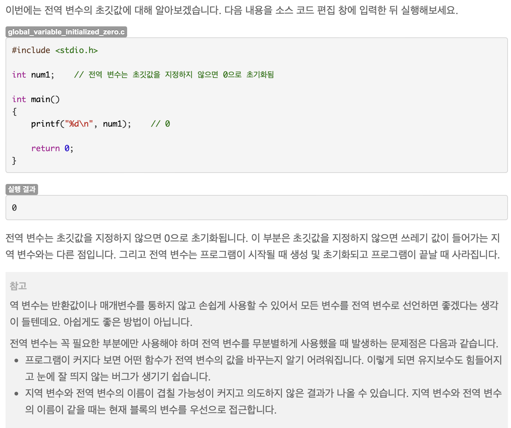

# 1-B

- 알파벳 개수
- [문제링크](http://boj.kr/1a1898996c8542889b32b4c1b2498dd0)

## 알면 좋은점



> - 밖에다 전역 변수 선언하면 초기화 되는듯..? 왜인지 모르겠음

- 해설

  ```c++
  #include<bits/stdc++.h>
  using namespace std;
  typedef long long ll;
  string str;
  int cnt[26];
  int main(){
      ios_base::sync_with_stdio(false); cin.tie(NULL); cout.tie(NULL);
      cin >> str;
      for(char a : str){
        cnt[a - 'a']++;
    }
    for(int i = 0; i < 26; i++) cout << cnt[i] << " ";

    return 0;
  }

  ```

- 내코드

  ```c++
  #include <bits/stdc++.h>
  #include <iostream>
  #include <algorithm>
  using namespace std;

  int main() {

      ios_base::sync_with_stdio(false);
      cin.tie(NULL); cout.tie(NULL);

      string str;
      int alpha[26];

      for(int k; k < 26; k++){
          alpha[k]=0;
      }

      cin >> str;

      for(char c : str){
          alpha[c-'a'] += 1;
      }

      for(int k : alpha){
          cout << k << ' ';
      }

      return 0;


  }
  ```
