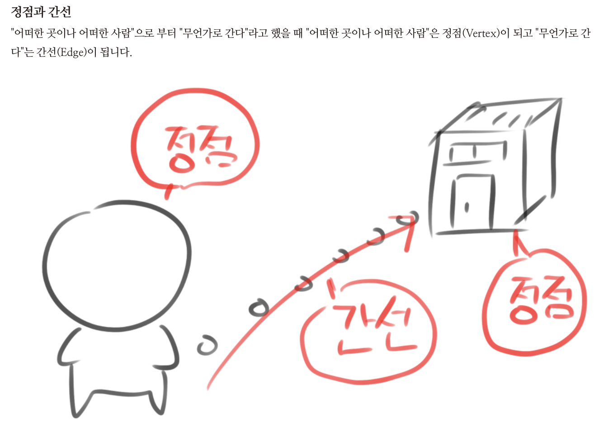
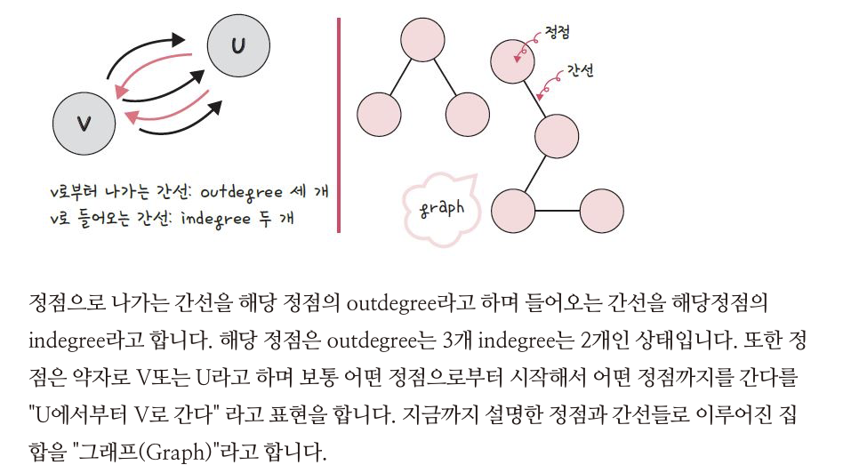
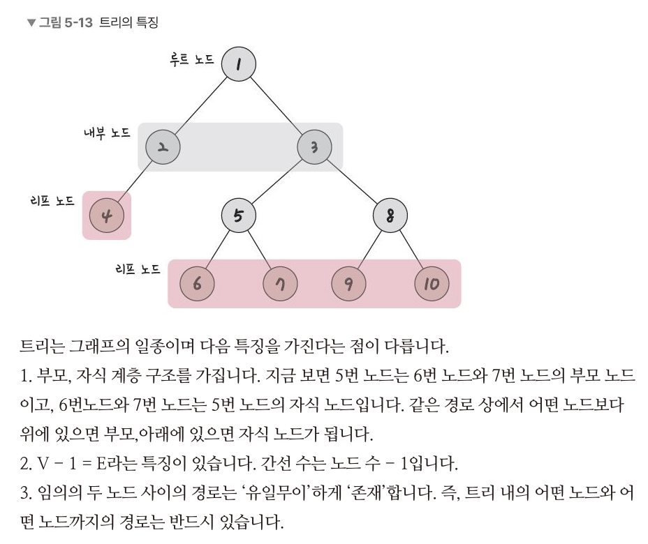
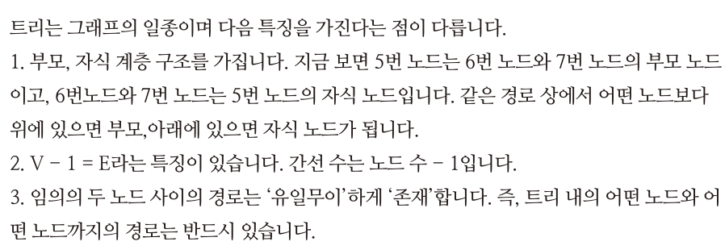
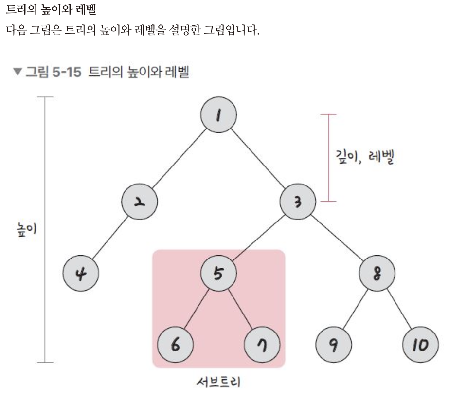
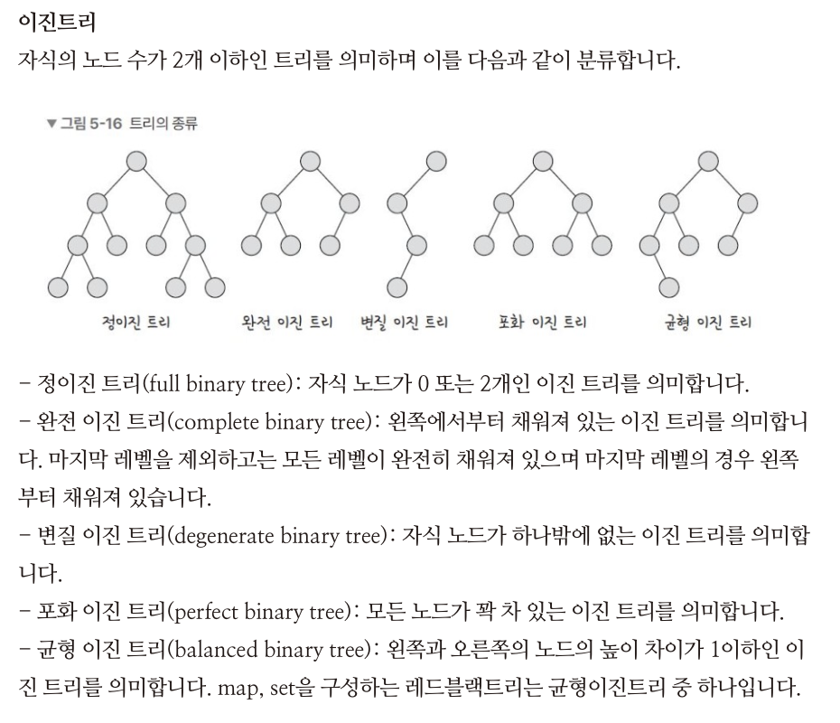
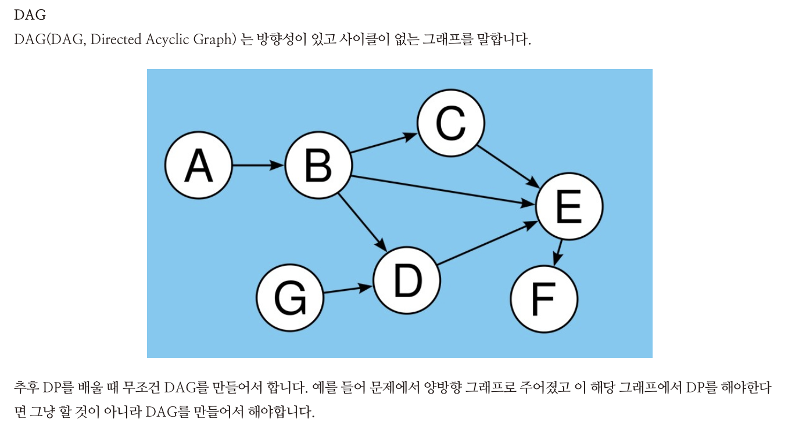
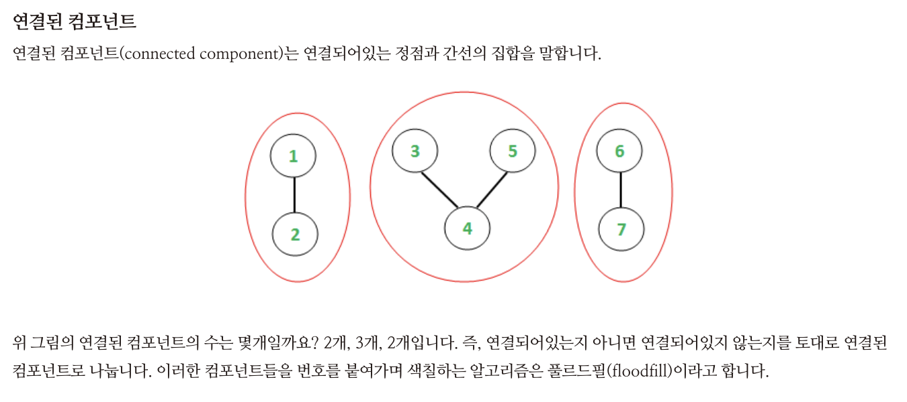
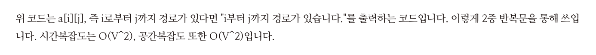
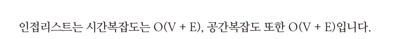

# 그래프이론 DFS / BFS

> 출처 : https://blog.naver.com/jhc9639/222289089015

> 그래프이론과 DFS(깊이우선탐색), BFS(너비우선탐색) 그리고 트리순회인 preorder, inorder, postorder를 다루겠습니다

## 1) 정점과 간선



- 정점 : Vertex, 꼭지점
- 간선 : Edge, 변

## 2) 방향이 있는 그래프이론


- 단방향
- 양방향

## 3) 그래프의 가중치

간선과 정점사이에 드는 비용

## 4) 그래프의 out / in



<br>
<br>

# 트리



트리는 그래프 이론에서 `사이클이 없는 무방향 그래프` 또는 사이클이 없는 방향그래프인 DAG(Directed Acyclic Graph)를 지칭



## 1) 루트노드 & 내부노드 & 리프노드




## 2) 이진트리


- map, set 은 "균형이진트리"로 이루어져있다

<br>
<br>

# DAG



- "양방향 & DP" -> DAG

<br>
<br>

# 연결된 컴포넌트



- 간선으로 연결된 노드들의 집합; 한 그래프에 대한 것

<br>
<br>

# 그래프표현방법

## 1) 표현 방법

`컴퓨터에게 내가 이러한 그래프를 그렸다고 알려줄 표현방법` 으로는 인접행렬과 인접리스트

### 1) 인접행렬

- 모든 간선에 대해서 정보를 표기하여 행렬로 나타낸 것
- C++ 에서는 보통 boolean 2차원 사용

  인접행렬이란 그래프에서 정점과 간선의 관계를 나타내는 정사각형 행렬을 의미합니다. 보통 불리언2차원행렬을 쓰며 예를 들어 2차원배열 a[1004][1004]가 정의되어있을 때 a[1][3] = 1이라는 뜻은 1로부터 3까지 가는 경로가 있다는 의미를 말하며 a[1][2] = 0이라면 1로부터 2까지 가는 경로가 없다는 것을 의미합니다.

- 예시

  ```c++
  bool a[1004][1004];
  for(int i = 0;i < V; i++){
      for(int j = 0; j < V; j++){
          if(a[i][j]){
              cout << i << "부터 " << j << "까지 경로가 있습니다.\n";
          }
      }
  }
  ```

- 시간 & 공간복잡도

  

### 2) 인접리스트

- 연결된 부분만 사용
- 벡터를 여러개를 가지는 array를 사용

인접 리스트(adjacency list)는 그정점에서 정점을 연결하는 것을 하나의 연결 리스트를 통해 표현하는 것  
`위코드처럼 숏컷을 써서 해야 빠르고 디버깅이 쉽습니다.`

- 예시

  ```c++
  vector<int> adj[1004];
  adj[1].push_back(2); // 1에서 2로 간다
  for(int i = 0;i < V; i++){

      // 순회하는 방법, adj[i] 자체가 그 자리에 있는 vector
      for(int there : adj[i]){

      }

      //위와 아래 코드는 의미가 같습니다.
      for(int j = 0; j < adj[i].size(); j++){
          int there = adj[i][j];
      }
  }
  ```

- 시간 & 공간복잡도
  

## 2) 무엇을 쓰는것이 좋을까?

> 보통 인접리스트로 할 생각을 하고 문제에서 만약에 인접행렬로 주어졌다면 인접행렬로 푸는 것이 좋음
