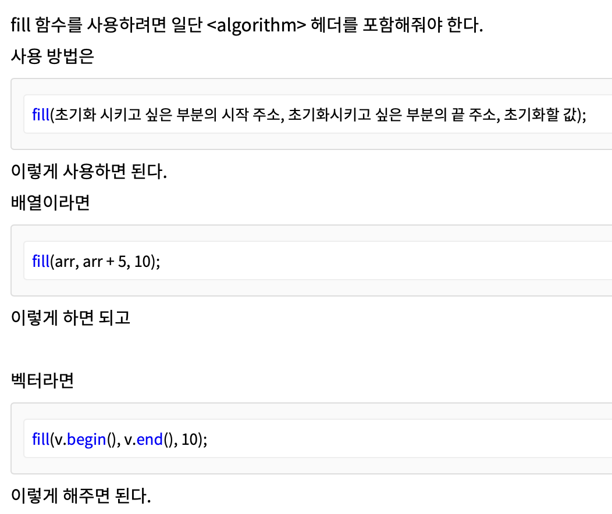

# 2-B

- [문제링크](https://www.acmicpc.net/problem/1012)

## 알면 좋은점

> 1. fill 함수 :: [링크](https://breakcoding.tistory.com/285)  
>    1)) algorighm 헤더 포함  
>    2)) 사용법 : fill(초기화 시키고 싶은 부분의 시작 주소, 초기화시키고 싶은 부분의 끝 주소, 초기화할 값);  
>    3)) 배열 : fill(arr, arr + 5, 10);  
>    4)) 벡터 : fill(v.begin(), v.end(), 10);  
>    5)) 2d 배열
>    - fill(&a[0][0], &a[0][0] + 51 \* 51, 0);
>    - fill(&visited[0][0], &visited[0][0] + 51 \* 51, 0);  
>      

- 2번 input
  

<br>

## 코드

- 해설

  ```c++
  #include<bits/stdc++.h>
  using namespace std;
  int dy[4] = {-1, 0, 1, 0};
  int dx[4] = {0, 1, 0, -1};
  int m, n, k, y, x, ret, ny, nx, t;
  int a[51][51];
  bool visited[51][51];
  void dfs(int y, int x){
      visited[y][x] = 1;
      for(int i = 0; i < 4; i++){
          ny = y + dy[i];
          nx = x + dx[i];
          if(ny < 0 || nx < 0 || ny >=n || nx >= m) continue;
          if(a[ny][nx] == 1 && !visited[ny][nx]){
              dfs(ny, nx);
          }
      }
      return;
  }

  int main(){
      cin.tie(NULL);
      cout.tie(NULL);
      cin >> t;
      while(t--){
          fill(&a[0][0], &a[0][0] + 51 * 51, 0);
          fill(&visited[0][0], &visited[0][0] + 51 * 51, 0);
          ret = 0;
          cin >> m >> n >> k;
          for(int i = 0; i < k; i++){
              cin >> x >> y;
              a[y][x] = 1;
          }
          for(int i = 0; i < n; i++){
              for(int j = 0; j < m; j++){
                  if(a[i][j] == 1 && !visited[i][j]){
                      dfs(i, j);
                      ret++;
                  }
              }
          }
          cout << ret << "\n";
      }
      return 0;
  }


  ```

- 내코드

  ```c++
  #include <bits/stdc++.h>
  #include <queue>
  #include <utility>
  #include <tuple>

  //
  bool isInputPresent = true;
  int T;
  int N, M, K, tmpY, tmpX, ny, nx;
  int _map[50][50], visited[50][50];
  int _count;
  int const dx[4] = {1, 0, -1, 0};
  int const dy[4] = {0, 1, 0, -1};

  using namespace std;
  void initMap();
  void getInput();
  void BFS(int x, int y, bool isFirst);

  void initMap(){

      _count = 0;

      for(int i1=0; i1 < 50; i1++){
          for(int i2=0; i2 < 50; i2++){
              _map[i1][i2] = 0;
              visited[i1][i2] = 0;
          }
      }
  }

  void getInput(){
      cin >> N >> M >> K;

      cout << "N : " << N << " M : " << M << "\n";

      initMap();
      for(int m=0; m < K; m ++){
          // scanf("%d %d", &tmpY, &tmpX);
          cin >> tmpY >> tmpX;
          cout << "temp YX => " << "tmpY : " << tmpY << " tmp X : " << tmpX << " \n";
          _map[tmpY][tmpX] = 1;
      }
  }

  void BFS(int y, int x, bool isFirst){
      cout << "visited[y][x] : " << visited[y][x] << " _map[ny][nx] : " << _map[ny][nx] << "\n";
      if(visited[y][x] == 1 || _map[y][x]==0) return;

      visited[y][x] = 1;

      for(int k=0; k < 4; k++){
          ny = y + dy[k];
          nx = x + dx[k];
          if(0<=ny && ny<N && 0<=nx && nx<M && _map[ny][nx]==1 && visited[ny][nx]==0){
              cout << "  -- ny, nx => " << " ny : " << ny << " nx : " << nx << "\n";
              BFS(ny, nx, false);
              }

      }


      if(isFirst) {cout << "count is up!" << "\n"; _count += 1;}

      return;
  }

  int main(){

      ios_base::sync_with_stdio(false);
      cin.tie(NULL); cout.tie(NULL);

      if(isInputPresent) freopen("input.txt", "r", stdin);
      // scanf( "%d", &T);
      cin >> T;

      for(int _numTry=0; _numTry < T; _numTry ++){
          cout << "========= " << _numTry << "\n";
          getInput();

          for(int i1=0; i1<N; i1 ++){
              for(int i2=0; i2<M; i2 ++){
                  cout << "sweeping => " << " i1(y) : " << i1 << " i2(x) : " << i2 << "\n";
                  if(_map[i1][i2]==1) BFS(i1, i2, true);

              }
          }

          cout << _count << "\n";

      }


      return 0;
  }

  ```
