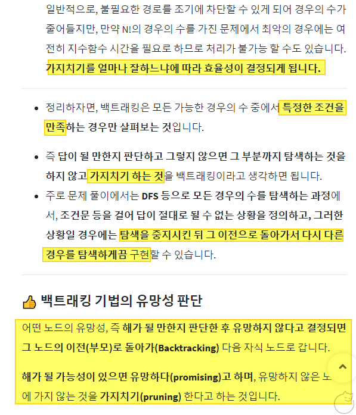

# 해설
- [해설 링크1](https://jeongchul.tistory.com/674)
- [해설 링크2](https://dirmathfl.tistory.com/116)

## Solve 여부
- True
- Brutal로 계산, itertools.permutation r = len(Operation 개수) 로 해결

## 내용
- 문제유형 : 시뮬레이션
- 문제풀이 :
    
    1) 모든 순열을 구하고, 순서대로 조건에 맞게 연산을 수행
    2) 배열 생성 이후, min / max를 구하여 해결
    
- 해설
    > itertools 대신, 재귀 / for loop 등으로 구현해서 해결할 수 있음
    - **`max_, min_ = -1e9, 1e9`** 를 이용하여 min/max 함수 이용할 수 있도록 세팅
    - **`재귀로 모든 조합의 경우의 수를 나눠서 counter == 연산할 숫자의 개수와 같아질 때 까지, answwer을 업데이트 함`**
    - 이문제가 무조건 백트래킹과 일치하지는 않지만, 재귀로 들어가면서 판단하는 과정까지는 같음
    - 탐색 깊이가 너무 깊으면 재귀보다는 dynamic하게 해결
    
    
> Note : 백트래킹이란?
> [참조링크](https://chanhuiseok.github.io/posts/algo-23/)
> 정의 : 해를 찾는 도중, 해가 "절대 아닌 것"이 보장되어 막히게 되면, 되돌아가서 해를 다시 찾는 기법.
> 보통 절대 안되는 기준을 불만족하면 부모 노드(탐색)으로 돌아가 다른 자식을 다시 탐색하는 것을 말함
        

## 주의하기

- **`풀이 제출할 때, print 문 없애는게 좋음 -> 전부 메모리 잡아먹으니깐`**

## 문제풀이

- 해설
```python
n = int(input())
number = list(map(int, input().split()))
operation = list(map(int, input().split())) # +, -, X, %

max_, min_ = -1e9, 1e9

def solve(counter, answer, add, sub, mul, div):
	global max_, min_
	if counter== n: # operation 수와 일치하다면 종료
		max_ = max(max_, answer) # 최대
		min_ = min(min_, answer) # 최소
		return
	if add: # 덧셈
		solve(counter+1, answer+number[counter], add-1, sub, mul, div)
	if sub: # 뺄셈
		solve(counter+1, answer-number[counter], add, sub-1, mul, div)
	if mul: # 곱셈
		solve(counter+1, answer*number[counter], add, sub, mul-1, div)
	if div: # 나눗셈, 음수의 경우 원하는 사칙연산 값이 안나오므로 양수로 처리 계산 결과 음수 처리 
		solve(counter+1, answer//number[counter] if answer > 0 else -((-answer)//number[counter]),
			  add, sub, mul, div-1)

solve(1, number[0], operation[0], operation[1], operation[2], operation[3])
print('%d\n%d'%(max_, min_))

# 출처: https://jeongchul.tistory.com/674 [Jeongchul]
```


<br>

- 내풀이
```python
import sys
import itertools

def yprint(string, isEnabled=False):
	if isEnabled:
		print(string)

def wrapper(i):
	print(11*10*9*8*7*6*5*4*3*2)
	for j in range(i):
		yprint(f'\n'*2)
		yprint(f'#'*30)
		N, dataNumber, dataOperation = init()
		solution(j,  N, dataNumber, dataOperation)


def init():
	N = int(input())
	dataNumber = list(map(int, input().split(' ')))
	dataOperation = list(map(int, input().split(' ')))

	yprint(f'N :{N}')
	yprint(f'dataNumber :{dataNumber}')
	yprint(f'dataOperation :{dataOperation}')
	opsIdx = ['+', '-', 'x', '/']
	filterDataOperation = []
	for idx, num in enumerate(dataOperation):
		filterDataOperation.extend([opsIdx[idx]]*num)
	yprint(f'filterDataOperation : {filterDataOperation}')

	return N, dataNumber, filterDataOperation

def solution(testIter,  N, dataNumber, dataOperation):

	dataPermu = list(itertools.permutations(dataOperation, r=len(dataOperation)))

	yprint(f'dataPermu : {dataPermu}')

	record = []
	for operation in dataPermu:
		yprint(f'operation : {operation}')
		answer = dataNumber[0]
		for idxNum, valueNum in enumerate(dataNumber):
			yprint(f'idxNum, valueNum : {idxNum, valueNum}')
			try:
				if idxNum == 0 : continue
				if operation[idxNum-1] == '+':
					answer = answer + valueNum
				elif operation[idxNum-1] == '-':
					answer = answer - valueNum
				elif operation[idxNum-1] == 'x':
					answer = answer * valueNum
				elif operation[idxNum-1] == '/':
					answer = -(abs(answer)//valueNum) if answer < 0 else answer//valueNum
			except:pass

		record.append(answer)

	print(max(record))
	print(min(record))

if __name__=="__main__":
	sys.stdin = open('sample_input.txt', 'r')
	wrapper(3)

```
