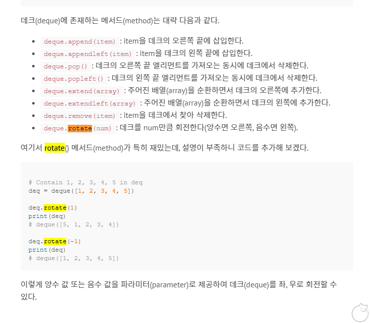

# 해설
- [해설 링크1](https://dirmathfl.tistory.com/246)
- [해설 링크1](https://esoongan.tistory.com/38)
  

## Solve 여부
- False ; 저조한 컨디션, 문제 이해 여부 낮음 -> True
- **`반드시 문제 전부 파악하고 문제 작성`**
  - 배열 start가 12시인 것을 몰랐음
  - 바퀴 회전할 때, 조건 잘 살펴보면 좋았을 것


## 내용
- 문제유형 : 시뮬레이션
- 문제풀이 :

    1) 그냥 구현해서 해셜

- 해설
    - **`deque 에 rotate함수가 따로 있다고 함`**
    - .rotate(n) 메서드 -> 1: 오른쪽으로 n칸씩 밀림, -1 : 왼쪽으로 n칸씩 밀림
    
    


## 주의하기

- **`풀이 제출할 때, print 문 없애는게 좋음 -> 전부 메모리 잡아먹으니깐`**
- **`test 함수 만들어서 간단한 동작은 검증을 하는 것이 맞는듯`**
  - 계속 간단한 부분에서 걸려가지고 전체 디버깅 시간이 늘어나고 있음...
  - 문제파악 잘 하는 것과 더불어서 이부분도 해결해야 할 듯!


## 문제풀이

- 해설
```python
from sys import stdin
from collections import deque


def move_gear(idx, cur_dir):
  global cur_right, cur_left, gears
  origin_dir = cur_dir

  # 현재 톱니바퀴를 기준으로 좌측의 톱니바퀴들 확인.
  for i in reversed(range(idx)):
    if cur_right != gears[i][LEFT]:
      cur_right = gears[i][RIGHT]
      gears[i].rotate(cur_dir * -1)
      cur_dir *= -1
    else:
      break

  cur_dir = origin_dir
  # 현재 톱니바퀴를 기준으로 우측의 톱니바퀴들 확인.
  for i in range(idx + 1, 4):
    if gears[i][RIGHT] != cur_left:
      cur_left = gears[i][LEFT]
      gears[i].rotate(cur_dir * -1)
      cur_dir *= -1
    else:
      break


if __name__ == '__main__':
  LEFT, RIGHT = 2, 6
  gears = [deque(map(int, stdin.readline().strip())) for _ in range(4)]
  k = int(stdin.readline())
  orders = [list(map(int, stdin.readline().split())) for _ in range(k)]

  for gear_idx, direction in orders:
    gear_idx -= 1
    cur_left, cur_right = gears[gear_idx][LEFT], gears[gear_idx][RIGHT]
    gears[gear_idx].rotate(direction)
    move_gear(gear_idx, direction)

  print(sum([2 ** delta if gear[0] else 0 for delta, gear in enumerate(gears)]))

```

<br>

- 내풀이
```python


from collections import  deque
POS1 = 6
POS2 = 2
POS_12 = 0

def yprint(string, isEnabled=True):
  if isEnabled:
    print(string)


def wrapper(i):

  for j in range(i):
    yprint('\n'*2)
    yprint('#'*20)
    dataDisk, dataOrder = init()
    solution(i, dataDisk, dataOrder)


def init():
  dataDisk = [ deque(list(map(int, list(input())) )) for _ in range(4) ]
  tmpN = int(input())
  dataOrder = [ list(map(int, input().split(' '))) for _ in range(tmpN)]
  dataOrder = [ [data[0]-1, data[1]] for data in dataOrder]

  yprint(f'dataDisk : {dataDisk}')
  yprint(f'tmpN : {tmpN}')
  yprint(f'dataOrder : {dataOrder}')

  return dataDisk, dataOrder

def rotateDisks(dataDisk, rotation):

  for idxDisk, value in enumerate(rotation):
    if value == 2:
      continue

    # if value == 1: # 시계방향
    # 	dataDisk[idxDisk].appendleft(dataDisk[idxDisk].popleft())
    # else:
    # 	dataDisk[idxDisk].append(dataDisk[idxDisk].pop())

    if value == 1: # 시계방향
      dataDisk[idxDisk].rotate(1)
    else:
      dataDisk[idxDisk].rotate(-1)

def calculateScore(dataDisk):

  score = 0
  for idx in range(4):
    if dataDisk[idx][POS_12] == 1:
      if idx == 0:
        score += 1
      elif idx == 1:
        score += 2
      elif idx == 2:
        score += 4
      elif idx == 3:
        score += 8

  return score


def solution(testIteration, dataDisk, dataOrder):

  for order in dataOrder:

    rotation = [0]*4
    rotation[order[0]] = order[1]
    subSolution(dataDisk, order, rotation, 1 )
    yprint(f'rotation - result : {rotation}')
    rotateDisks(dataDisk, rotation)
    yprint(f'dataDisk - middle ; {dataDisk}')

  yprint(f'dataDisk - final ; {dataDisk}')
  answer = calculateScore(dataDisk)
  yprint(f'answer : {answer}')
  print(answer)

def subSolution(dataDisk, order, rotation, counter):
  # rotation 1: 시계 -1 : 반시계 2: 멈춤, 0 : nor decided

  if counter == 4:
    pass
    return
  yprint(f'*'*13)
  yprint(f'counter - before ; {counter}')
  yprint(f'rotation - before: {rotation}')
  for idxDisk, value in enumerate(rotation):
    if value != 0: pass
    else:
      if idxDisk == 0:
        if rotation[1] != 0:
          if rotation[1] == 2:
            rotation[0] = 2
            counter += 1
          else:
            tmpRot = -rotation[1] if dataDisk[0][POS2] != dataDisk[1][POS1] else 2
            rotation[0] = tmpRot
            counter += 1
      if idxDisk == 1:
        if rotation[0] != 0:
          if rotation[0] == 2:
            rotation[1] = 2
            counter += 1
          else:
            tmpRot = -rotation[0] if dataDisk[0][POS2] != dataDisk[1][POS1] else 2
            rotation[1] = tmpRot
            counter += 1
        elif rotation[2] != 0:
          if rotation[2] == 2:
            rotation[1] = 2
            counter += 1
          else:
            tmpRot = -rotation[2] if dataDisk[1][POS2] != dataDisk[2][POS1] else 2
            rotation[1] = tmpRot
            counter += 1
      if idxDisk == 2:
        if rotation[1] != 0:
          if rotation[1] == 2:
            yprint('2-1')
            rotation[2] = 2
            counter += 1
          else:
            yprint('2-2')
            yprint(f'dataDisk[1][POS2] : {dataDisk[1][POS2]}')
            yprint(f'dataDisk[2][POS1] : {dataDisk[2][POS1]}')
            tmpRot = -rotation[1] if dataDisk[1][POS2] != dataDisk[2][POS1] else 2
            rotation[2] = tmpRot
            counter += 1
        elif rotation[3] != 0:
          yprint('2-3')
          if rotation[3] == 2:
            rotation[2] = 2
            counter += 1
          else:
            yprint('2-4')
            tmpRot = -rotation[3] if dataDisk[2][POS2] != dataDisk[3][POS1] else 2
            rotation[2] = tmpRot
            counter += 1
      if idxDisk == 3:
        if rotation[2] != 0:
          if rotation[2] == 2:
            rotation[3] = 2
            counter += 1
          else:
            tmpRot = -rotation[2] if dataDisk[2][POS2] != dataDisk[3][POS1] else 2
            rotation[3] = tmpRot
            counter += 1

  yprint(f'counter - after ; {counter}')
  yprint(f'rotation - after: {rotation}')
  subSolution(dataDisk, order, rotation, counter)
  return


if __name__ == '__main__':
  import sys
  sys.stdin = open('sample_input.txt', 'r')
  wrapper(4)

```
