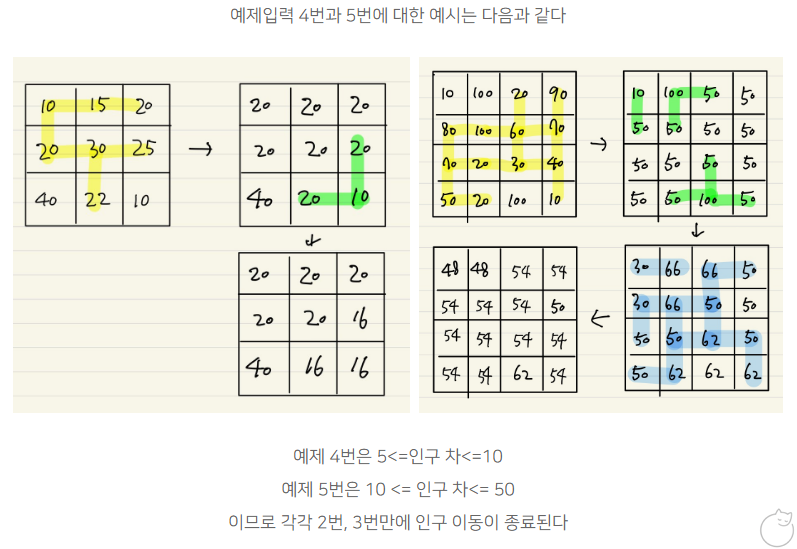

# 해설
- [해설 링크1](https://yeoping.tistory.com/27)
- [해설 링크2](https://2jinishappy.tistory.com/58)


## Solve 여부
- False/True
    - **`문제가 틀린 경우가 있는데 뭔지 잘 모르겠음, 틀린 테스트케이스 볼 수 있었으면 좋겠음`**
        - 만약 문제가 있다면 서로소 알고리즘에 있지 않을까 추측...?
    - **`서로소 알고리즘 주의할 점`**
      1) Cycling 피하기 위해, parent가 다를때만 업데이트 해주기
      2) 한 원소의 parent 검색할 때, findParent 함수 사용해서 찾기
      3) Recursion limit피하기 위해서 while loop 사용하기

> 주의 예시

```python

...

### 1)
def unionFind(dataCountry, country1, country2):
	parent1 = findParent(dataCountry, country1)
	parent2 = findParent(dataCountry, country2)

	# if counter1 >= counter2:
	# 	dataCountry[parent2] = parent1
	# else:
	# 	dataCountry[parent1] = parent2
	if parent1 != parent2: # avoid cycle
		dataCountry[parent1] = parent2

...

### 2)
unitedSet = set([ findParent(dataCountry, key) for key, value in dataCountry.items() ])

...

### 3)
def findParent(dataCountry, country):
	# if dataCountry[country] == country:
	# 	return country
	# else:
	# 	return findParent(dataCountry, dataCountry[country])
	targetCountry = dataCountry[country]
	while( True ):
		if targetCountry == country:
			return targetCountry
		else:
			country = targetCountry
			targetCountry = dataCountry[country]
            
...

```


## 내용
- 문제유형 : UnionFind, DFS 탐색, int, rount,  //  연산
- 문제풀이 :

    1) 그냥 구현하여 해결하는 문제
    2) 서로소 알고리즘 및 집합 찾기 

- 해설
    - **`서로소 알고리즘 사용 유의해서 해결하기!`**



## 주의하기

- **`풀이 제출할 때, print 문 없애는게 좋음 -> 전부 메모리 잡아먹으니깐`**
- **`test 함수 만들어서 간단한 동작은 검증을 하는 것이 맞는듯`**


## 문제풀이

- 해설

```python
from collections import deque

def find_union(start,num):
	dq = deque()
	dq.append(start)
	union[start[0]][start[1]]=num
	union_sum=A[start[0]][start[1]]
	union_cnt=1
	while dq:
		x,y=dq.popleft()
		for k in range(4):
			nx=x+di[k][0]
			ny=y+di[k][1]

			if 0<=nx<N and 0<=ny<N and union[nx][ny]==-1 and L<=abs(A[x][y]-A[nx][ny])<=R:
				union_sum+=A[nx][ny]
				union[nx][ny]=num
				union_cnt+=1
				dq.append([nx,ny])
	return [union_sum,union_cnt]

N,L,R=map(int,input().split())
A = [list(map(int,input().split())) for _ in range(N)]

di = [[-1,0],[0,-1],[1,0],[0,1]]
cnt=0
while True:
	union = [[-1] * N for _ in range(N)]
	n=0
	union_info={}
	for i in range(N):
		for j in range(N):
			if union[i][j]==-1:
				union_info[n]=find_union([i,j],n)
				n+=1

	if n==N*N:    # 모든 국경선이 열리지 않음
		break

	# 국경 업데이트
	for i in range(N):
		for j in range(N):
			A[i][j]=union_info[union[i][j]][0]//union_info[union[i][j]][1]
	cnt+=1
print(cnt)
```


<br>

- 내풀이(수정후)
```python
# 5
import math
import pprint

def yprint(string, isEnabled=False):
	if isEnabled:
		print(string)


def wrapper(i):

	for j in range(i):
		yprint('\n'*2)
		yprint('#'*30)
		N, L, R, dataMap = init()
		solution(j, N, L, R, dataMap)

def findParent(dataCountry, country):
	if dataCountry[country] == country:
		return country
	else:
		return findParent(dataCountry, dataCountry[country])

def unionFind(dataCountry, country1, country2):
	parent1 = findParent(dataCountry, country1)
	parent2 = findParent(dataCountry, country2)

	# if counter1 >= counter2:
	# 	dataCountry[parent2] = parent1
	# else:
	# 	dataCountry[parent1] = parent2
	if parent1 != parent2: # avoid cycle
		dataCountry[parent1] = parent2

def init():
	N, L, R = map(int, input().split())
	dataMap = [ list(map(int, input().split())) for _ in range(N) ]

	yprint(f'N, L, R  : {N, L, R }')
	yprint(f'dataMap  : {dataMap}')

	return N, L, R, dataMap

def solution(testIter, N, L, R, dataMap):
	dx = [1, 0, -1, 0]
	dy = [0, 1, 0, -1]
	yMax, xMax = N-1, N-1
	count = 0
	while True:
		yprint('')
		yprint('-'*20)
		dataCountry = {(rowIdx, colIdx):(rowIdx, colIdx) for rowIdx, rowVal in enumerate(dataMap) \
					   for colIdx, colVal in enumerate(rowVal)}
		yprint(f'  - count : {count}')
		yprint(f'dataCountry init : {dataCountry}')

		for rowIdx, rowVal in enumerate(dataMap):
			for colIdx, colVal in enumerate(rowVal):
				for direction in range(4):
					nextY = rowIdx + dy[direction]
					nextX = colIdx + dx[direction]
					if 0 <= nextY <= yMax and 0 <= nextX <= xMax:
						targetCountryVal = dataMap[nextY][nextX]
						if L <= abs(targetCountryVal - colVal) <= R:
							unionFind(dataCountry, country1=(rowIdx, colIdx), country2=(nextY,nextX))
							# parentBaseNode = unionFind(dataCountry, (rowIdx, colIdx))
							# parentTargetNode = unionFind(dataCountry, (nextY, nextX))
							# if parentTargetNode != parentBaseNode:
							# 	dataCountry[(nextY, nextX)] = parentBaseNode
							#dataCountry[(nextY, nextX)] = unionFind(dataCountry, (rowIdx, colIdx))

		yprint(f'dataCountry after : {dataCountry}')

		unitedSet = set([ findParent(dataCountry, key) for key, value in dataCountry.items() ])
		yprint(f'unitedSet : {unitedSet}')
		yprint('********')
		for union in unitedSet:
			tmp = []
			for key, val in dataCountry.items():
				if findParent(dataCountry,key) == union:
					tmp.append(key)
			yprint(f'union : {union} -> list : {sorted(tmp)}')
		yprint('********')

		if len(unitedSet) == N**2:
			break
		else:
			count += 1

		for parentCountry in unitedSet:
			sumNum = 0
			countNum = 0
			record = []
			for key, value in dataCountry.items():
				if findParent(dataCountry,key) == parentCountry:
					record.append(key)
					countNum += 1
					sumNum += dataMap[key[0]][key[1]]

			yprint(f'record : {record}')
			yprint(f'sumNum, countNum : {sumNum, countNum}')
			targetVal = sumNum // countNum
			yprint(f'targetVal : {targetVal}')
			for country in record:
				dataMap[country[0]][country[1]] = targetVal

			yprint(f'  >  dataMap middle : ')
			#pprint.pprint(dataMap, )

	yprint(f'dataMap final : {dataMap}')
	print(count)

if __name__ == '__main__':
	import sys
	sys.stdin = open('sample_input.txt', 'r')
	wrapper(5)
```


- 내풀이(수정전)
```python
# 5
import math

def yprint(string, isEnabled=True):
	if isEnabled:
		print(string)


def wrapper(i):

	for j in range(i):
		yprint('\n'*2)
		yprint('#'*30)
		N, L, R, dataMap = init()
		solution(j, N, L, R, dataMap)

def unionFind(dataCountry, country):
	if dataCountry[country] == country:
		return country
	else:
		return unionFind(dataCountry, dataCountry[country])

def init():
	N, L, R = map(int, input().split())
	dataMap = [ list(map(int, input().split())) for _ in range(N) ]

	yprint(f'N, L, R  : {N, L, R }')
	yprint(f'dataMap  : {dataMap}')

	return N, L, R, dataMap

def solution(testIter, N, L, R, dataMap):
	dx = [1, 0, -1, 0]
	dy = [0, 1, 0, -1]
	yMax, xMax = N-1, N-1
	count = 0
	while True:
		dataCountry = {(rowIdx, colIdx):(rowIdx, colIdx) for rowIdx, rowVal in enumerate(dataMap)
					   for colIdx, colVal in enumerate(rowVal)}
		yprint(f'dataCountry init : {dataCountry}')

		for rowIdx, rowVal in enumerate(dataMap):
			for colIdx, colVal in enumerate(rowVal):
				for direction in range(4):
					nextY = rowIdx + dy[direction]
					nextX = colIdx + dx[direction]
					if 0 <= nextY <= yMax and 0 <= nextX <= xMax:
						targetCountryVal = dataMap[nextY][nextX]
						if L <= abs(targetCountryVal - colVal) <= R:
							dataCountry[(nextY, nextX)] = unionFind(dataCountry, (rowIdx, colIdx))

		yprint(f'dataCountry after : {dataCountry}')

		unitedSet = set([ value for key, value in dataCountry.items() ])
		yprint(f'unitedSet : {unitedSet}')

		if len(unitedSet) == N**2:
			break
		else:
			count += 1

		for parentCountry in unitedSet:
			sumNum = 0
			countNum = 0
			record = []
			for key, value in dataCountry.items():
				if value == parentCountry:
					record.append(key)
					countNum += 1
					sumNum += dataMap[key[0]][key[1]]

			yprint(f'record : {record}')
			yprint(f'sumNum, countNum : {sumNum, countNum}')
			targetVal = int(sumNum / countNum)
			for country in record:
				dataMap[country[0]][country[1]] = targetVal

			yprint(f'dataMap middle : {dataMap}')

	yprint(f'dataMap final : {dataMap}')
	print(count)

if __name__ == '__main__':
	import sys
	sys.stdin = open('sample_input.txt', 'r')
	wrapper(5)
```

