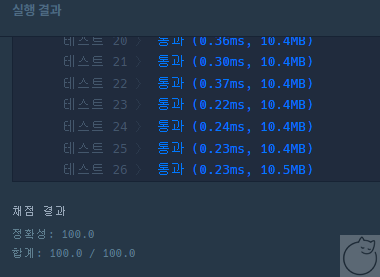

# 해설

## 참고 링크

## Solve 여부
- True

## Solve 시간
- 30분 정도?

## Solve 점수


## 내용
- 문제유형 : 구현 - 문자열
- 문제풀이 :

    1) 그냥 구현하여 해결하는 문제


- 해설
    - **`그냥 구현!`**
    - 조건들 잘 읽어보고 하기
    - 계획 잘 세워서 잘 하였음


## 주의하기

- **`test 함수 만들어서 간단한 동작은 검증을 하는 것이 맞는듯`**
  - 카카오는 IDE에서도 가능


## 문제풀이

- 해설
```python
```

<br>

- 내풀이
```python

import re

def solution(new_id):

	# 1단계 new_id의 모든 대문자를 대응되는 소문자로 치환합니다.
	new_id = new_id.lower()

	# 2단계 new_id에서 알파벳 소문자, 숫자, 빼기(-), 밑줄(_), 마침표(.)를 제외한 모든 문자를 제거합니다.
	new_string = ''
	reObj = re.compile('[a-zA-Z0-9]')
	specialChar = '~!@#$%^&*()=+[{]}:?,<>/'
	for _str in new_id:
		if ((_str not in specialChar) or (reObj.match(_str))) :
			new_string += _str
	new_id = new_string

	# 3단계 new_id에서 마침표(.)가 2번 이상 연속된 부분을 하나의 마침표(.)로 치환합니다.
	reObj = re.compile('[.]{2,}')
	new_id = reObj.sub('.', new_id)


	# 4단계 new_id에서 마침표(.)가 처음이나 끝에 위치한다면 제거합니다.
	if new_id.startswith('.'):
		new_id = new_id[1:]
	if new_id.endswith('.'):
		new_id = new_id[:-1]

	# 5단계 new_id가 빈 문자열이라면, new_id에 "a"를 대입합니다.
	if not new_id:
		new_id += 'a'

	# 6단계 new_id의 길이가 16자 이상이면, new_id의 첫 15개의 문자를 제외한 나머지 문자들을 모두 제거합니다.
	#만약 제거 후 마침표(.)가 new_id의 끝에 위치한다면 끝에 위치한 마침표(.) 문자를 제거합니다.
	new_id = new_id[:15]
	if new_id.endswith('.'):
		new_id = new_id[:-1]

	#7단계 new_id의 길이가 2자 이하라면, new_id의 마지막 문자를 new_id의 길이가 3이 될 때까지 반복해서 끝에 붙입니다.
	iterNum = len(new_id)
	if iterNum <= 2:
		lastChr = new_id[-1]
		for _ in range(3 - iterNum):
			new_id += lastChr

	return new_id

```
