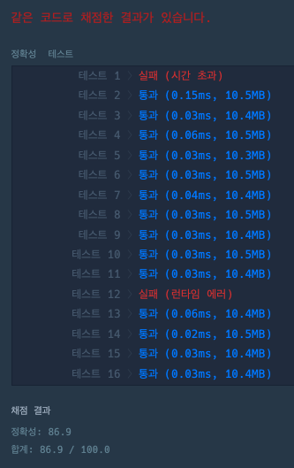

# 해설
- [해설 링크1](https://kimjingo.tistory.com/147?category=946327)


## Solve 여부
- True;


## 시간
  1) 1시간 -> 85점, 코드 구현 살짝 잘못된거 같은데, 실제 시험있으면 이렇게 제출했을 듯

## 내용
- 문제유형 : 구현 / 소수 판별 / 0으로 쪼개기
- 문제풀이 :

    1) 그냥 구현하여 해결하는 문제 
    2) *회전 부분을 하드코딩으로 짠건 잘했음 -> 하드코딩 적절하게 잘 섞을 것!*


- 해설
    - **`그냥 구현!`**


## 주의하기

- **`풀이 제출할 때, print 문 없애는게 좋음 -> 전부 메모리 잡아먹으니깐`**
- **`test 함수 만들어서 간단한 동작은 검증을 하는 것이 맞는듯`**
- 문제 잘 읽는 것 습관 잘 들인 듯
- 복잡하게 생각하면 말리는 경우 있음(프로그래머스 기준)
  - 삼성은 뭔가 깊게 예외처리에 대해서 고민해야함


## 문제풀이

- 해설
```python
def to_k_number(n, k):  # n을 k진수로 반환
    ret = ""
    while n > 0:
        ret += str(n % k)
        n = n //  k
    return ''.join(reversed(ret))
 
 
def is_prime_num(k):
    if k == 2 or k == 3: return True  # 2 or 3 은 소수
    if k % 2 == 0 or k < 2: return False  # 2의 배수이거나 2보다 작은 값인 경우 소수가 아님
    # 3부터 root(k)까지 2씩 증가하며 확인(3, 5, 7...),
    # 이는 작은 값들의 배수일 때 발생하는 중복을 제거하며 확인(소수 찾기 최적화)
    for i in range(3, int(k ** 0.5) + 1, 2):
        if k % i == 0:
            return False
    return True
 
 
def solution(n, k):
    answer = 0
    k_num = to_k_number(n, k)  # k진₩수로 반환
    # k_num을 0을 기준으로 분할하여 n을 가져옴
    for n in k_num.split('0'):
        if n == "": continue
        if is_prime_num(int(n)):  # n이 소수인 경우 answer+=1
            answer += 1
    return answer

```

<br>

- 내풀이



<br>

```python
import re

globalPrimeSet = set()
globalNotPrimeSet = set()

def isPrime(stingNum, k):
    global globalPrimeSet, globalNotPrimeSet
    if stingNum in globalPrimeSet:
        return True
    if stingNum in globalNotPrimeSet:
        return False

    #intNumber = int(stingNum, k)
    intNumber = int(stingNum)
    if stingNum == '1' or '0' in stingNum:
        globalNotPrimeSet.add(stingNum)
        return False

    for j in range(1, intNumber):
        if j ==1:continue
        if intNumber % j == 0:
            globalNotPrimeSet.add(stingNum)
            return False

    globalPrimeSet.add(stingNum)
    return True

def separate2(string, k):
    primeHistory = []
    stringLength = len(string)
    idx_start = 0
    idx_end = 0

    if len(string) == 1:
        if isPrime(string, k):
            return 1
        else: return 0

    for idx_end in range(0, stringLength):
        if not idx_end >= idx_start: continue
        if idx_end == stringLength - 1: # no next
            tmpSubStr = string[idx_start:idx_end + 1]
            if isPrime(tmpSubStr, k):
                primeHistory.append(tmpSubStr)
                break
        else:
            if string[idx_end+1] == '0':
                tmpSubStr = string[idx_start:idx_end+1]
                if isPrime(tmpSubStr, k):
                    primeHistory.append(tmpSubStr)
                    # idx_start = idx_end + 2
                else:
                    pass
                idx_start = idx_end + 1
                while string[idx_start] == '0':
                    idx_start += 1
            else:
                continue

    return len(primeHistory)


def solution(n, k):


    converted = convert_to_k(n, k)
    print(f'converted : {converted}')


    length = separate2(converted, k)
    print(f'length : {length}')

    return length


def convert_to_k(n, k):
    rev_base = ''

    while n > 0:
        n, mod = divmod(n, k)
        rev_base += str(mod)

    return rev_base[::-1]

if __name__ == '__main__':
    n = 110011
    k = 10
    solution(n, k)

```


