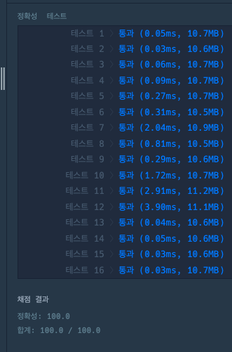

# 해설
- Blank


## Solve 여부
- True;


## 시간
  1) 30분

## 내용
- 문제유형 : 구현
- 문제풀이 :

    1) 그냥 구현하여 해결하는 문제


## 주의하기

- **`풀이 제출할 때, print 문 없애는게 좋음 -> 전부 메모리 잡아먹으니깐`**
- **`test 함수 만들어서 간단한 동작은 검증을 하는 것이 맞는듯`**
- 문제 잘 읽는 것 습관 잘 들인 듯
- 복잡하게 생각하면 말리는 경우 있음(프로그래머스 기준)
  - 삼성은 뭔가 깊게 예외처리에 대해서 고민해야함


## 문제풀이

- 해설
```python
```

<br>

- 내풀이



<br>

```python


def solution(fees, records):

    기본_시간, 기본_요금, 단위_시간, 단위_요금 = fees

    record_data = {
    }

    for record in records:
        time, carNum, Direction = record.split(' ')
        print(f'time, carNum, Direction : {time, carNum, Direction}')

        if carNum not in record_data:
            record_data[carNum] = {
                'IN':[],
                'OUT':[]
            }

        if Direction == 'IN':
            record_data[carNum]['IN'].append(time)
        elif Direction == 'OUT':
            record_data[carNum]['OUT'].append(time)


    # Index correction
    for carNum in record_data:
        len1 = len(record_data[carNum]['IN'])
        len2 = len(record_data[carNum]['OUT'])
        if len1 !=  len2:
            for _ in range(int(len1-len2)):
                record_data[carNum]['OUT'].append('23:59')


    # calculate fees
    fees_history = {
        key:0 for key in record_data.keys()
    }
    for key, val in record_data.items():
        print(f'key : {key}')
        timeLaps = 0
        for group in zip(val['IN'], val['OUT']):
            print(f'group : {group}')
            tmpTimeLaps = praseMinute(group[0], group[1])
            print(f'tmpTimeLaps : {tmpTimeLaps}')
            timeLaps += tmpTimeLaps

        totalCharge = 0
        if timeLaps <= 기본_시간:
            totalCharge += 기본_요금
        else:
            totalCharge += 기본_요금
            tmpUpper = ( (timeLaps - 기본_시간) / 단위_시간 )
            tmpUpper = int(tmpUpper + 1) if int(tmpUpper) < tmpUpper else int(tmpUpper)
            totalCharge += tmpUpper * 단위_요금

        fees_history[key] = totalCharge


    return [ fees_history[key] for key in sorted(fees_history.keys()) ]

def praseMinute(string1, string2):
    h1, m1 = string1.split(':')
    h1, m1 = int(h1), int(m1)

    h2, m2 = string2.split(':')
    h2, m2 = int(h2), int(m2)

    total1, total2 = (h1 * 60) + m1, (h2 * 60) + m2

    return abs(total2-total1)


if __name__ == "__main__":
    type = 0
    if type == 0:
        fees = [180, 5000, 10, 600]
        records = ["05:34 5961 IN", "06:00 0000 IN", "06:34 0000 OUT", "07:59 5961 OUT", "07:59 0148 IN", "18:59 0000 IN", "19:09 0148 OUT", "22:59 5961 IN", "23:00 5961 OUT"]

    solution(fees, records)

```


