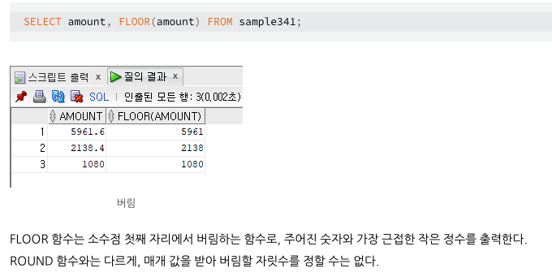

# 해설

1. [해설]()

# 문제 링크

[링크](https://school.programmers.co.kr/learn/courses/30/lessons/131530)

## 배울점

> 1. floor( ) 함수 :
>    

> 2. case 절 : select 절에서 ( )로 감싼 후 사용
>    CASE, WHEN, ELSE, END로 syntax 유지해야 함

> 3. TRUNCATE( ) 함수 : 
> "TRUNCATE(숫자, 버림 할 자리수)"의 형태로 사용

## 내코드

```sql
-- 코드를 입력하세요

```

## 정답코드

### 1 방법

```sql
-- 코드를 입력하세요
SELECT
    floor(price/10000)*10000 as price_group
    , count(product_id)
from product
group by floor(price/10000)
order by floor(price/10000) asc;

```

### 2 방법

```sql
-- 코드를 입력하세요
SELECT (
    CASE
    WHEN PRICE < 10000 THEN 0
    ELSE TRUNCATE(PRICE, -4)
    END
) AS PRICE_GROUP , COUNT(PRODUCT_ID)
FROM PRODUCT
GROUP BY PRICE_GROUP
ORDER BY PRICE_GROUP;

```

### 3 방법

```sql
-- 코드를 입력하세요
SELECT TRUNCATE(PRICE, -4) AS PRICE_GROUP, COUNT (*) AS PRODUCTS
FROM PRODUCT
GROUP BY PRICE_GROUP
ORDER BY PRICE_GROUP;

```

### 4 방법

```sql
-- 코드를 입력하세요
SELECT (CASE \
    WHEN PRICE BETWEEN 0 AND 9999 THEN '0'
    WHEN PRICE BETWEEN 10000 AND 19999 THEN '10000'
    WHEN PRICE BETWEEN 20000 AND 29999 THEN '20000'
    WHEN PRICE BETWEEN 30000 AND 39999 THEN '30000'
    WHEN PRICE BETWEEN 40000 AND 49999 THEN '40000'
    WHEN PRICE BETWEEN 50000 AND 59999 THEN '50000'
    WHEN PRICE BETWEEN 60000 AND 69999 THEN '60000'
    WHEN PRICE BETWEEN 70000 AND 79999 THEN '70000'
    WHEN PRICE BETWEEN 80000 AND 89999 THEN '80000' END) AS PRICE_GROUP,
    COUNT (* ) AS PRODUCTS
FROM PRODUCT
GROUP BY PRICE_GROUP
ORDER BY PRICE_GROUP

```

---
