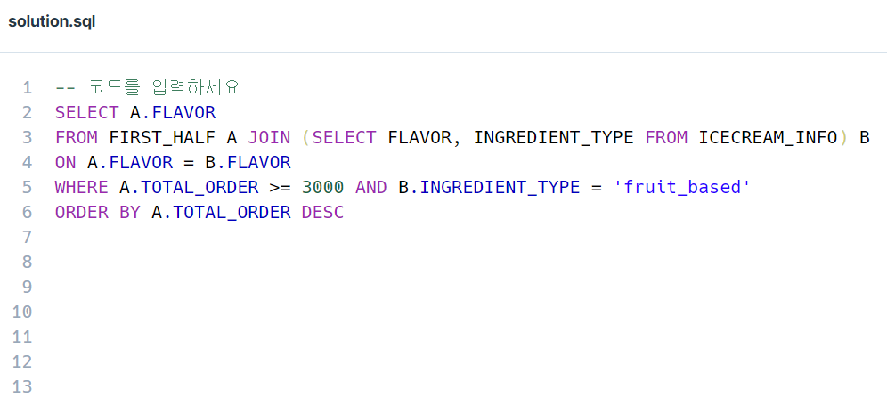
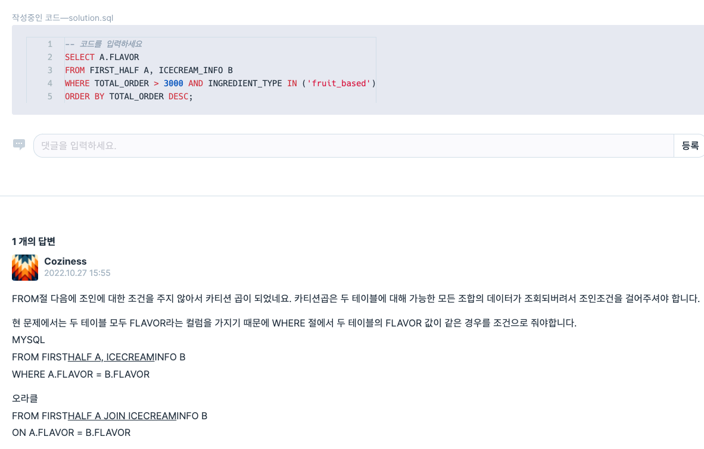

# 해설

1. [해설]()

## 배울점

> 1.

## 내코드

```sql
SELECT i.FLAVOR
    FROM
        FIRST_HALF as f,
        ICECREAM_INFO as i
    WHERE
        i.FLAVOR = f.FLAVOR AND
        i.INGREDIENT_TYPE = 'fruit_based' AND f.TOTAL_ORDER > 3000
    GROUP BY
        i.FLAVOR
    ORDER BY
        f.TOTAL_ORDER DESC;
```

## 정답코드

### 1 방법

```sql
-- 코드를 입력하세요
SELECT a.FLAVOR FROM FIRST_HALF a LEFT JOIN ICECREAM_INFO b ON
a.FLAVOR = b.FLAVOR
WHERE a.TOTAL_ORDER > 3000 AND b.INGREDIENT_TYPE LIKE "fruit_based"
ORDER BY a.TOTAL_ORDER DESC
```

### 2 방법

```sql
/*
INNTER JOIN ICECREAM_INFO i
ON f.FAVOR = i.FAVOR;
*/
-- 코드를 입력하세요
SELECT f.FLAVOR
FROM FIRST_HALF f, ICECREAM_INFO i
WHERE f.FLAVOR = i.FLAVOR AND ingredient_type = 'fruit_based' AND total_order >=3000
ORDER BY total_order DESC;
```

### 3방법



---


