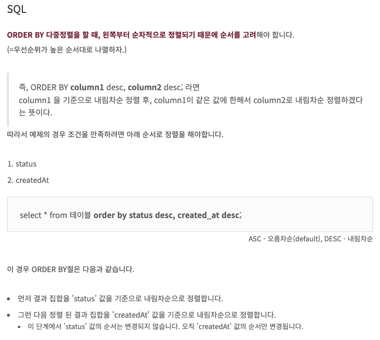

# 해설

1. [해설]()

# 문제 링크

[링크](https://school.programmers.co.kr/learn/courses/30/lessons/133024)

## 배울점

> 1. 여러개의 정렬 사용; 다중정렬 [링크](https://dar0m.tistory.com/60)



## 내코드

```sql
-- 코드를 입력하세요
-- SHOW TABLE STATUS;

select flavor from first_half
    order by total_order desc, shipment_id asc;

-- as A ORDER BY SHIPMENT_ID ASC;
```

## 정답코드

### 1 방법

```sql
-- 코드를 입력하세요

```

---
