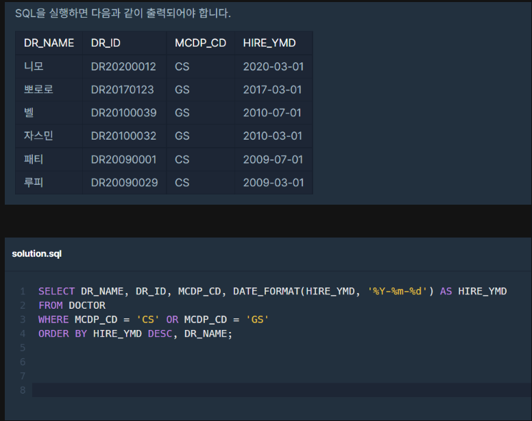

# 해설

1. [해설](https://velog.io/@hrlrh/%ED%94%84%EB%A1%9C%EA%B7%B8%EB%9E%98%EB%A8%B8%EC%8A%A4-%ED%9D%89%EB%B6%80%EC%99%B8%EA%B3%BC-%EB%98%90%EB%8A%94-%EC%9D%BC%EB%B0%98%EC%99%B8%EA%B3%BC-%EC%9D%98%EC%82%AC-%EB%AA%A9%EB%A1%9D-%EC%B6%9C%EB%A0%A5%ED%95%98%EA%B8%B0)

# 문제 링크

[링크](https://school.programmers.co.kr/learn/courses/30/lessons/132203)

## 배울점

> 1. 날짜 형변환 -> to_char 보통 사용하는 듯
>    [참조 링크](https://m.blog.naver.com/httyu/221205076445)
> 2. 프로그래머스에서는 위의 함수 사용 못하고, DATE_FORMAT 사용  
>    `재미있는게 Y / y 가 출력이 다름! 주의할 것` > 

## 내코드

```sql
-- 코드를 입력하세요
show table status;
select * from doctor;

select dr_name, dr_id, mcdp_cd, date_format(HIRE_YMD,'%Y-%m-%d') as HIRE_TMD from doctor
    where (mcdp_cd = 'CS' or mcdp_cd = 'GS')
    order by hire_ymd desc, dr_name asc;
```

## 정답코드

### 1 방법

```sql
-- 코드를 입력하세요

```

---
