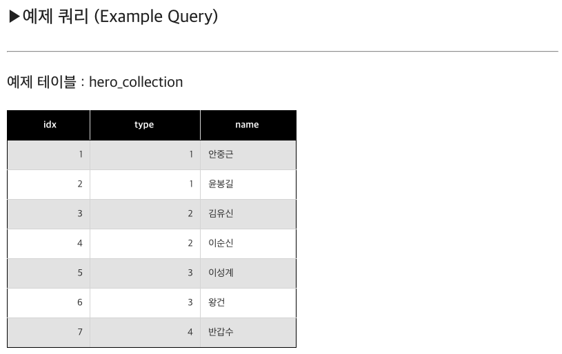
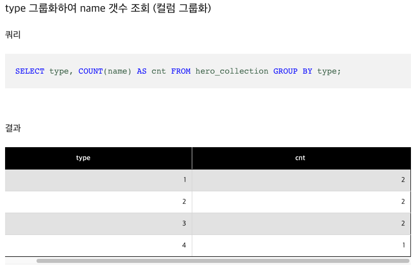
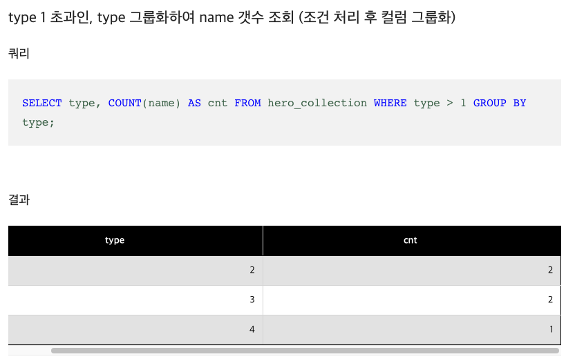

# 해설

1. [해설]()

# 문제 링크

[링크](https://school.programmers.co.kr/learn/courses/30/lessons/132202)

## 배울점

> 1. date_format 함수임!!!!! 주의
> 2. COUNT() 함수 사용 : [이부분 참조; Group으로 묶는 법](https://extbrain.tistory.com/56)





```sql
-- 코드를 입력하세요
select * from APPOINTMENT;

select mcdp_cd as 진료과코드, count(mcdp_cd) as 5월예약건수
from appointment
    where date_format(apnt_ymd, '%m') = '05'
    group by mcdp_cd
    order by 5월예약건수 asc, 진료과코드 asc;
```

## 정답코드

### 1 방법

```sql
-- 코드를 입력하세요
SELECT MCDP_CD as '진료과코드' , count(APNT_YMD) as '5월예약건수'
from APPOINTMENT
where date_format(APNT_YMD , '%Y-%m') = '2022-05'
group by MCDP_CD
order by 5월예약건수 , 진료과코드
```

---
