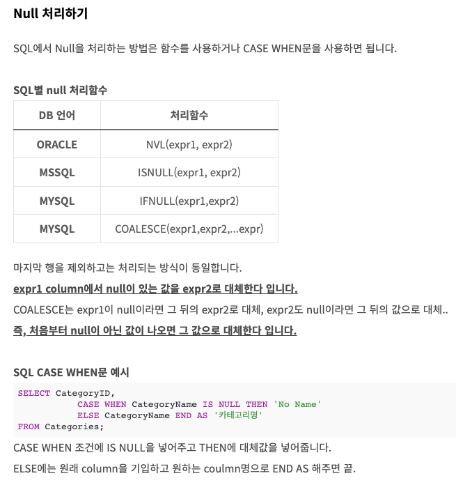

# 해설

1. [해설]()

# 문제 링크

[링크]()

## 배울점

> 1. NULL(결측값 대치) IFNULL 사용!!!! [예시](https://codingspooning.tistory.com/entry/SQL-null-%EC%B2%98%EB%A6%AC%ED%95%98%EA%B8%B0-%EC%A1%B0%ED%9A%8C-%EB%8C%80%EC%B2%B4)
>    

> 2.

```sql
-- 코드를 입력하세요
show table status;

select * from patient;

select pt_name, pt_no, gend_cd, age, ifnull(tlno, 'NONE') as tlno from patient
    where age <= 12 and gend_cd = 'W'
    order by age desc, pt_name asc;
```

## 정답코드

### 1 방법

```sql
-- 코드를 입력하세요

```

---
