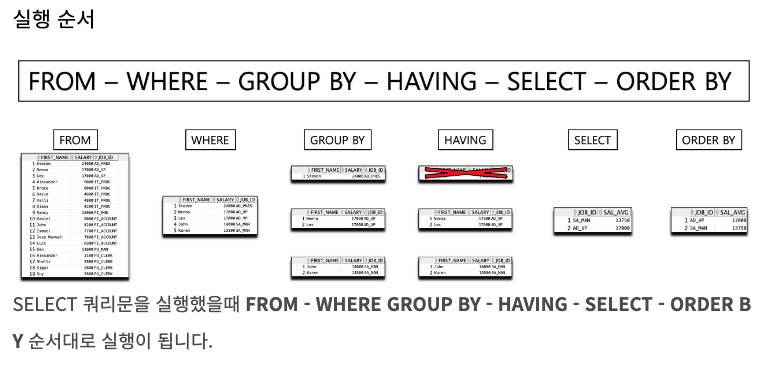
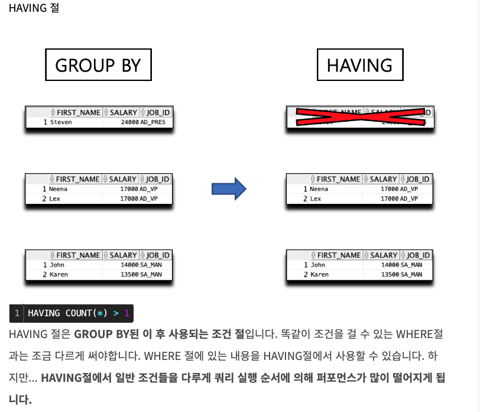
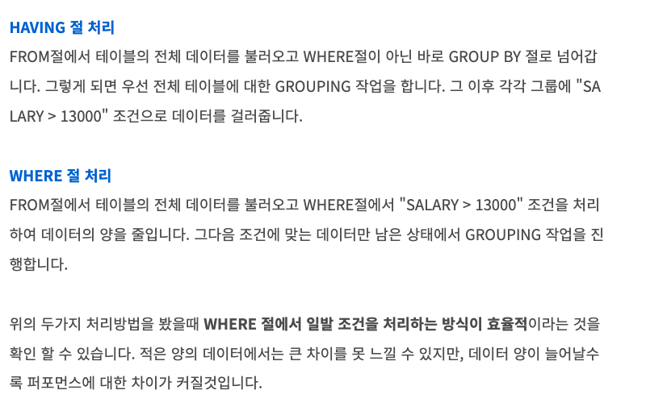

# SQL 쿼리 실행 순서 정리

## 링크

https://myjamong.tistory.com/172

### 1. 실행 순서

### 2. 기억할 것

- inplace가 아닌, 새 테이블에 대해서 작업이 수행되는 것으로 이해하면 됨
- Orderby 는 select 이후 마지막에 실행되기 때문에, alias 사용 가능

### 3. 주의

  

